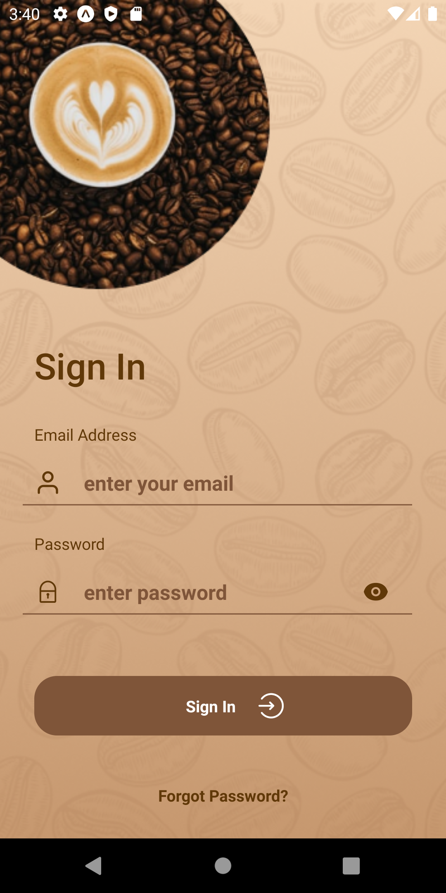
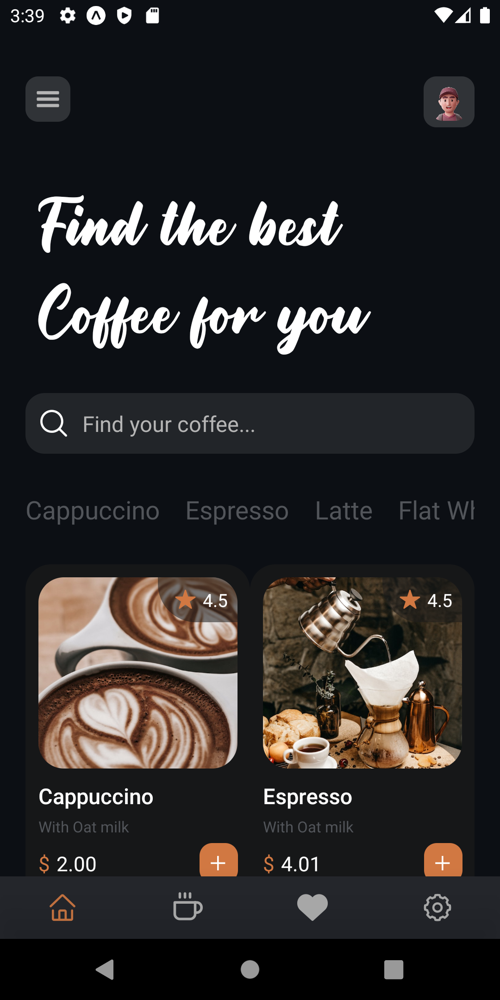

# CoffeeApp

Coffee House App built with expo and aws-amplify

<table>
  <tr>
    <td></td>
    <td></td>
  <!--   <td></td>
    <td></td> -->
  <tr>
  <tr>
    <td></td>
   <!--  <td></td>
    <td></td>
    <td></td> -->
  <tr>
  <tr>
    <td></td>
  <tr>
</table>

## How to use

- Clone
- Run `yarn or npm install` in the terminal
- Run on IOS or Android projects in emulator

## Dependencies

- react
- react context
- react-native
- expo
- expo/vector-icons
- react-navigation
- aws-amplify
- Formik
- yup
